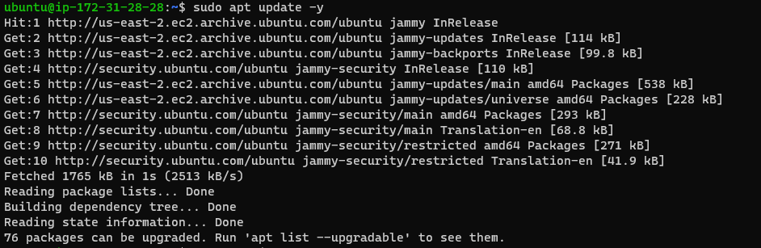

## Step1 

## Implement a Client Server Architecture using MySQL Database Management System

`sudo apt update -y`

`sudo apt install mysql-server -y`

`sudo apt install mysql-client -y`

`sudo systemctl enable mysql`

`sudo sql`

`sudo mysql_secure_installation`

`create user & database`

`cat mysqld.cnf`

`tcp-3306`

`sudo systemctl enable mysql`

`sudo mysql -u remote_user -h 172.31.28.28 -p`

`Show databases`

